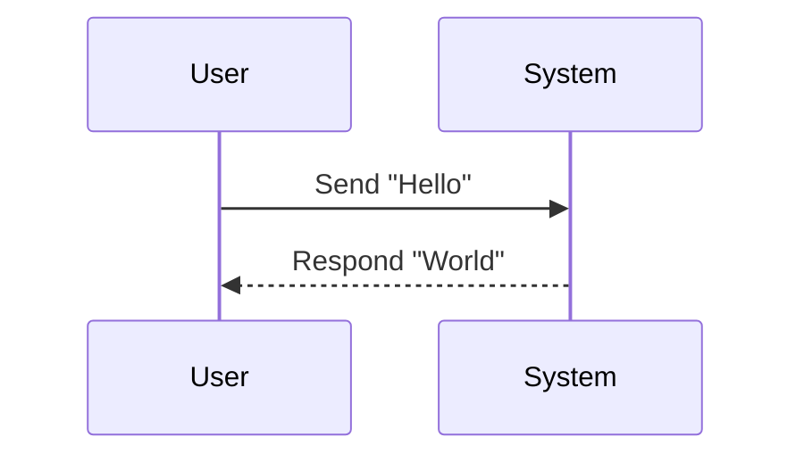
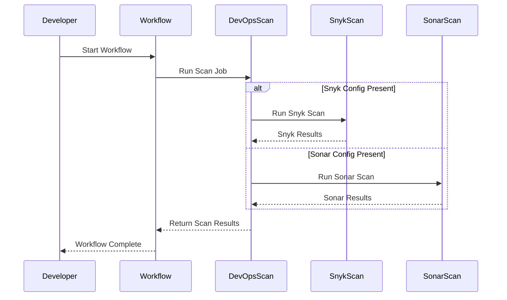

# Hello World Sequence Diagram

This diagram illustrates a basic interaction between a user and a system where the user sends a "Hello" message and the system responds with "World".

Seocnd diagram

